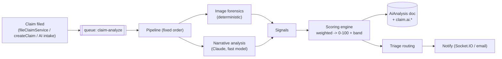

# Phase 1 — Fraud / Claims Intelligence Pipeline (Developer Spec)
### AVE / AVICS — AI Claims Intelligence Platform

**Audience:** Backend engineering team
**Scope:** The async analysis pipeline that runs **after a claim is filed** — deterministic image forensics + narrative analysis → fraud score → triage → explainability record. Phase 1 deliberately ships the parts that need **no historical data** and **no vision model**.
**Status:** Spec — not yet implemented.
**Depends on:** `Phase-1-Foundation.md` (Redis/BullMQ + worker, `AiAnalysis`/`FraudOutcome`/`Claim.ai`, enqueue hook, Claude wrapper). **Build the foundation first.**
**Companions:** `Phase-1-Developer-Guide.md`, `AI-Platform-Architecture.md`.

> Conventions: paths are relative to repo root. "Reuse" = call existing code.

---

## 1. What this pipeline delivers

Every filed claim is analysed in the background and gets a **fraud risk score (0–100)** + **Low/Med/High band**, combining:

| Signal source | Technique | Data used |
|---------------|-----------|-----------|
| **Image & evidence forensics** | Deterministic (no LLM) | `claim.supportingDocuments.photos[]` (customer photos) |
| **Claim narrative analysis** | Claude (text, cheap model) | `incidentDetails.description`, `description`, `damage` |

The score is persisted with full reasoning, the claim is flagged/routed, and the outcome is captured for later learning.

**Phase 1 = customer photos + text only.** Damage vision, repair-cost, leakage, networks and document extraction are Phase 2+ (see §11).

---

## 2. Where it runs

Triggered by the **enqueue hook** (foundation §9) on claim create/file — including the new AI intake path. Runs entirely on the **worker process** (`src/worker.js`), never in the HTTP request path.



> **Fixed pipeline, not an agent.** Phase 1 runs the analyzers in a deterministic order. The orchestration *agent* (deciding which checks to run) is Phase 3 — there's nothing expensive to gate yet.

---

## 3. Module layout (new, under the foundation's `src/ai/`)

```
src/ai/
  pipeline.js                  # entrypoint: run(claimId) -> orchestrates the stages
  analyzers/
    imageForensics.js          # deterministic (#3 subset)
    narrativeAnalysis.js       # Claude text (#4 subset)
  scoring/
    scoreEngine.js             # weighted aggregation -> 0-100 + reasoning (#6)
    triage.js                  # band -> routing + notify (#11)
    weights.js                 # configurable signal weights + band thresholds
```

The worker's `claim-analyze` processor (foundation §6) calls `require('./ai/pipeline').run(claimId)`.

---

## 4. Pipeline orchestrator — `src/ai/pipeline.js`

```
run(claimId):
  1. load claim (Claim.findById); set claim.ai.status = 'analyzing'
  2. signals = []
  3. signals.push(...await imageForensics.run(claim))     // deterministic, cheap
  4. signals.push(...await narrativeAnalysis.run(claim))   // 1 Claude call
  5. { score, band, reasoning } = await scoreEngine.aggregate(signals, claim)
  6. analysis = await AiAnalysis.create({ claimId, companyId, signals, score, band, reasoning, checksRun, modelVersions, tokensUsed })
  7. update claim.ai = { status:'analyzed', riskScore:score, riskBand:band, analysisId:analysis._id, analyzedAt:now }
  8. await triage.route(claim, band, analysis)
  on error: set claim.ai.status='error'; log; do NOT throw past the worker (BullMQ retry handles it)
```

Wrap each analyzer in try/catch so one failing check degrades gracefully (emit an `error` signal, continue).

---

## 5. Analyzer — Image & evidence forensics (`analyzers/imageForensics.js`)

**No LLM. Works on claim #1.** EXIF is preserved end-to-end because uploads store the raw buffer ([uploadpics.controller.js:23](../src/controllers/uploadpics.controller.js#L23)) — do not add image processing on the upload path.

Source: `claim.supportingDocuments.photos[]` (S3 URLs). Fetch each image's bytes (HTTP GET the S3 URL, or `@aws-sdk/client-s3` getObject).

| Check | Method | Signal on failure |
|-------|--------|-------------------|
| EXIF integrity | parse EXIF (`exifr`); flag missing/stripped/inconsistent metadata | `exif_stripped` |
| GPS vs incident | compare EXIF GPS to `incidentDetails.latitude/longitude` (or geocode `location`); flag large distance | `gps_mismatch` |
| Timestamp consistency | compare EXIF `DateTimeOriginal` to `incidentDetails.date`/`time`; flag mismatch | `timestamp_mismatch` |
| Duplicate / recycled | perceptual hash (`sharp` + pHash, or `image-hash`); compare against hashes of prior claims' photos | `duplicate_image` |

**Duplicate detection across claims:** store each photo's perceptual hash (e.g. in a small `claimPhotoHash` collection: `{ claimId, url, phash }`) and compare new photos against existing hashes (Hamming distance threshold). First claim has nothing to match — that's fine.

Each check emits a `Signal { type, severity: 'low'|'medium'|'high', value, evidence, explanation }` (shape from foundation §7.2).

---

## 6. Analyzer — Claim narrative analysis (`analyzers/narrativeAnalysis.js`)

One Claude call using the **fast model** (`ANTHROPIC_MODEL_FAST`, Haiku 4.5) via the foundation wrapper (`src/ai/llm/claude.js`), with **structured output** so the result is machine-readable.

- **Input:** `incidentDetails.description`, top-level `description`, `damage`, plus structured context (vehicles, time/location) for plausibility.
- **Ask the model to flag:** internal contradictions, templated/coached phrasing, implausible event sequences, and obvious mismatches with the structured fields.
- **Output schema:** `{ signals: [{ type, severity, explanation }] }` — map directly to `Signal[]`.
- **Text only in Phase 1.** Text-vs-image consistency is Phase 2 (needs vision).

Cache the static system prompt (the fraud-heuristics block) so repeat calls are cheap.

---

## 7. Scoring engine (`scoring/scoreEngine.js`) + weights

- **Weighted aggregation** of signals → `0–100`. Each signal type has a weight and a severity multiplier in `scoring/weights.js` (config, per-insurer later).
- **Bands** (defaults, configurable): `0–30 low`, `31–70 medium`, `71–100 high`.
- **Reasoning:** generate a short plain-English summary from the signal set (one cheap Claude call, fast model) — stored on `AiAnalysis.reasoning`.
- Respect the foundation's per-claim token ceiling.

```js
// weights.js (illustrative)
module.exports = {
  weights: {
    duplicate_image:    40,
    gps_mismatch:       25,
    timestamp_mismatch: 15,
    exif_stripped:      10,
    narrative_contradiction: 20,
    templated_language: 10,
    implausible_sequence: 20,
  },
  severityMultiplier: { low: 0.4, medium: 0.7, high: 1.0 },
  bands: { low: 30, medium: 70 }, // <=30 low, <=70 medium, else high
};
```
Score = `min(100, Σ weight(type) * severityMultiplier(severity))`.

---

## 8. Triage routing (`scoring/triage.js`)

Route by band **without disturbing the existing claim workflow** (`claim.status` stays as the human process expects). Triage = flag + notify, not auto-decide.

| Band | Action |
|------|--------|
| **low** | none beyond storing the score (eligible for fast-track review) |
| **medium** | notify the claims team to review; tag for manual review |
| **high** | set `claim.fraud.suspected = true` ([claim.model.js](../src/models/claim.model.js)); notify investigators |

- **No auto-approval, no auto-status-change.** The score lives in `claim.ai.*`; humans still decide.
- **Notifications:** reuse `notificationService.createAndEmit({ recipientId, recipientType, type, title, content, claimId })` ([notification.service.js](../src/service/notification.service.js)) — Socket.IO + email already wired.

---

## 9. Feedback capture — `FraudOutcome` (closes the loop)

Populate `FraudOutcome` (foundation §7.3) from the existing human transitions so learning (Phase 4) has labelled data from day one:
- on **approve** → `cleared` (or `settled` at payout)
- on **reject for fraud** / investigation-confirmed → `confirmed_fraud`

Wire into `approveClaim` / `rejectClaim` / investigation flows in [claim.service.js](../src/service/claim.service.js). Capture only — no training in Phase 1.

---

## 10. Cost controls (reuse foundation)

- **Deterministic-first:** image forensics run before any LLM call and can short-circuit obvious cases (e.g. a confirmed duplicate → high band without spending tokens elsewhere).
- **Fast model** for narrative + reasoning (Haiku 4.5).
- **Batch option:** since analysis is async, non-urgent claims can go through the Anthropic Batch API (50% off) later.
- Per-claim token ceiling enforced by `src/ai/llm/cost.js`. Expect **~KES 1–3 per claim** (forensics are free; one or two cheap Claude calls).

---

## 11. Out of scope (Phase 2+)

Damage detection & severity from photos (#5, vision), customer-vs-assessor / assessment-vs-reassessment photo comparison, plate/make-model OCR, repair-cost intelligence (#9), claims-leakage detection (#10), fraud-network/collusion detection (#8), document extraction/IDP, the orchestration **agent** (#1), and continuous-learning tuning (#12 — capture only here).

---

## 12. Build order & checklist

1. [ ] (Prereq) Foundation in place: queue/worker, `AiAnalysis`/`FraudOutcome`/`Claim.ai`, enqueue hook, Claude wrapper.
2. [ ] `analyzers/imageForensics.js` — EXIF, GPS, timestamp; S3 fetch helper; perceptual-hash store + cross-claim duplicate check.
3. [ ] `analyzers/narrativeAnalysis.js` — one structured Claude call (fast model).
4. [ ] `scoring/weights.js` + `scoring/scoreEngine.js` — aggregation + reasoning summary.
5. [ ] `scoring/triage.js` — band → flag + notify (reuse `notificationService`).
6. [ ] `src/ai/pipeline.js` — orchestrate stages; persist `AiAnalysis`; update `claim.ai.*`.
7. [ ] Replace the worker's stub `claim-analyze` processor with `pipeline.run(claimId)`.
8. [ ] Wire `FraudOutcome` capture into approve/reject/investigation transitions.

---

## 13. Verification (end-to-end)

1. Foundation running (worker up, Redis connected).
2. File a claim **with photos** (via the AI intake flow or `fileClaimService`). Confirm a `claim-analyze` job is enqueued and the worker picks it up.
3. Check the claim: `claim.ai.status === 'analyzed'`, a numeric `riskScore`, a `riskBand`, and an `AiAnalysis` doc with `signals[]` + `reasoning`.
4. **Forensic positive test:** file two claims using the **same photo** → the second scores a `duplicate_image` signal and a higher band.
5. **GPS test:** a photo whose EXIF GPS is far from `incidentDetails.location` → `gps_mismatch` signal.
6. **Narrative test:** a contradictory description (e.g. "parked and unattended" + "I was driving") → a contradiction signal.
7. **Triage:** a high-band claim sets `claim.fraud.suspected = true` and emits an investigator notification; low-band does neither.
8. **Cost log:** worker logs `[ai] … spend tokens=… ~KES …` per claim, within the per-claim ceiling.
